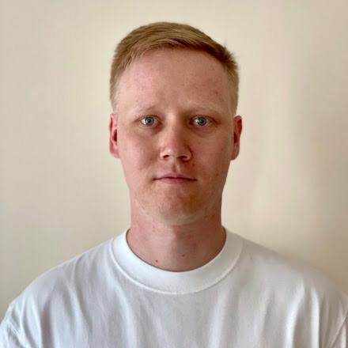

## rsschool-cv

# Zaostrovskikh Ivan


## Contacts
* Location: Astana, Kazakhstan
* e-mail: zaoivan@gmail.com
* Discord: zaoivan (@zaoivan)
* Telegram: franklstone

## About myself
I worked as an engineer for 10 years. Now I'm wondering how it works in the IT field

## Skills
I've just started learning
* Git (GitHub)
* Markdown (Visual Studio Code)

## Code example
I've just started learning, this is a task for registering on Codewars
```
function multiply(a, b){
  return a * b
}
```

## Experience
I worked in the specialty - automation in technical systems, for 10 years

## Education
I graduated the Ural Federal University, Faculty of Radio Engineering

## English
B1+ Intermediate - I study with a tutor. I participated in the work and travel program in America